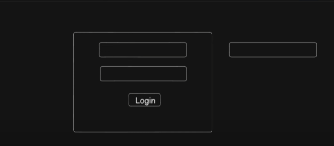

 
> Normally the login is made using the single wiindow and it just takes the input and update using the Hooks(Like left ) but in production grade applications , these inputs are taken in to a component to further use their data in the database and other operations.  
# Managing the components(Production grade react components)  
1. Containers:Build the container so that isse pure container ki propereties manage kr paaye. like bg colour width etc etc
2. Footers: Chhap diya Notes se, and Imported `react-router-dom` to use link
3. Header:
   - made `LogoutBtn.jsx` - logout btn design kr diya as a component
   - made the `nav bar` -
4. Navbar:- Inside the header file `useNavigate()` from react router dom , works just as `Link` -> NavBar me li se saare buttons ko list kraya
5. Made Input component for getting input-> `useRef()` hook from react used to provide ref to it `forward ref`: https://react.dev/reference/react/forwardRef